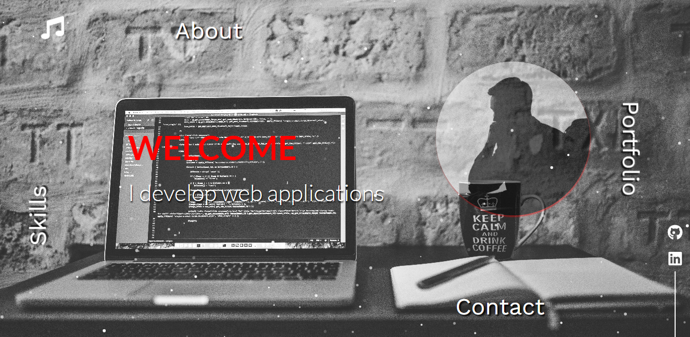
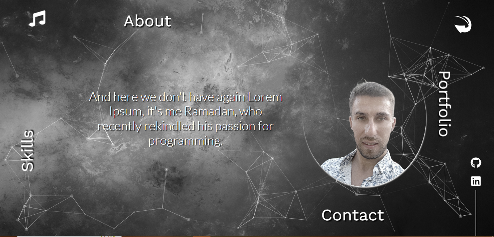
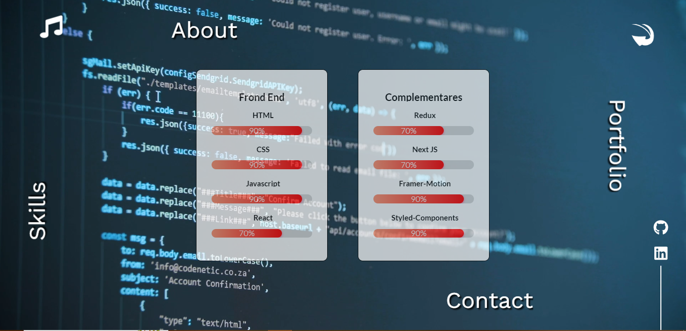
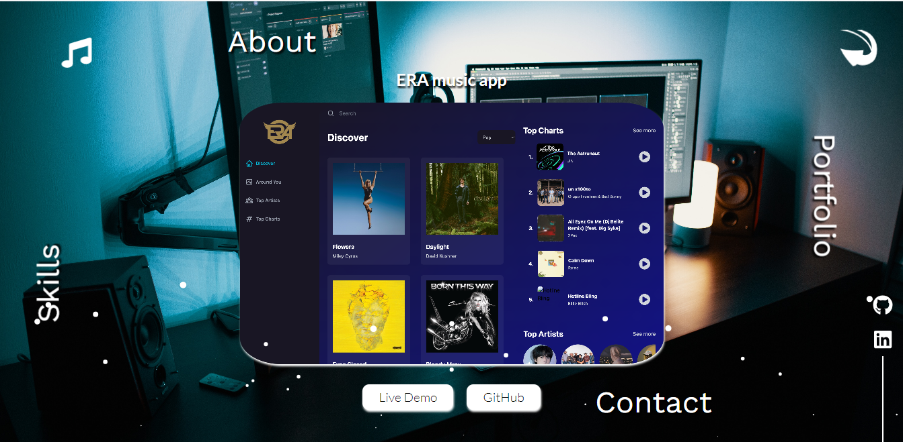
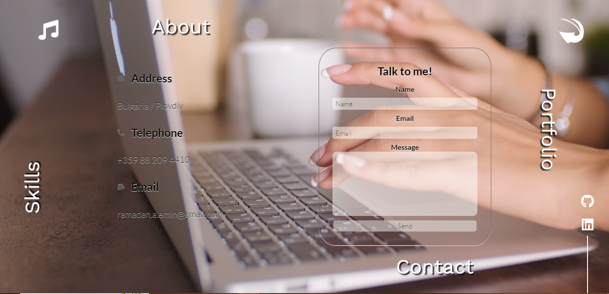

## Portfolio_project 

You can view the site here
[Click Me](https://era-portfolio-project.netlify.app)

## :books: Table of Contents

- [About](#raised_hands-about)
- [Technologies used](#gear-technologies-used)
- [Features](#pushpin-features)
- [Before you start](#how-to-use-this-app)
- [Author](#star-author)

## :raised_hands: About
 - This is a portfolio site that contains the projects made by me.
   
## :gear: Technologies used
- ReactJS
- React Tsparticles
- Framer Motion

## :pushpin: Features
<ul>
  <li>Intro</li>
  <li>About</li>
  <li>Skills</li>
  <li>Portfolio</li>
  <li>Contact</li>
</ul>

## How to use this App?

1. Clone this **repository** to your local computer.
2. Open **terminal** in root directory.
3. Type and Run `npm install` or `yarn install`.
4. Once packages are installed, you can start this app using `npm run dev`.
5. Now app is fully configured and you can start using this app :+1:.

## :star: Author

Ramadan Emin

